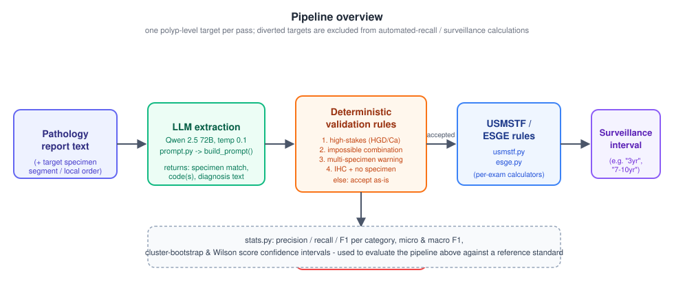

# pathology-ai-pipeline

AI-assisted extraction of structured histology findings from free-text colon
polyp pathology reports, paired with deterministic safety rules and
guideline-based post-polypectomy surveillance interval calculators.

This repository accompanies the manuscript *"Artificial intelligence-assisted
pathology processing for post-polypectomy surveillance"* (Kmeyha L,
Kandlikar-Bloch M, Moulla R, et al.; corresponding author: Daniel von Renteln,
MD). It's scoped to the manuscript's polyp_assessment analysis only, and
contains the pipeline's actual logic, prompt, codebook, and statistical
methods - fully generic and re-runnable - but **no patient data** (see
[What this repository does not contain](#what-this-repository-does-not-contain)).



## The clinical problem

How soon a patient should return for another colonoscopy depends on the
*histology* of every polyp removed, which lives in free-text pathology
reports, not structured fields. Extracting that at scale by hand doesn't
work, and naive automated extraction is dangerous if it's silently wrong on
the cases that matter most (high-grade dysplasia, cancer, multi-specimen
reports). This pipeline uses an LLM for extraction, wrapped in deterministic
rules that force every high-stakes or ambiguous case to human review instead
of guessing, then applies surveillance guidelines only to the targets it's
actually confident about.

## Pipeline overview

Starting from an already-structured target (a polyp's report text, segment,
and polyp number - see [What this repository does not contain](#what-this-repository-does-not-contain)):

1. **Specimen matching** ([`specimen_matching.py`](src/pathology_pipeline/specimen_matching.py)) -
   match a target polyp to its specimen in the report using a *local,
   within-segment* order instead of the database's global polyp number.
2. **LLM extraction** ([`prompt.py`](src/pathology_pipeline/prompt.py),
   [`llm_client.py`](src/pathology_pipeline/llm_client.py)) - send the report
   and specimen hints to the model (Qwen 2.5 72B via Ollama), get back
   histology code(s) and diagnosis text as JSON.
3. **Deterministic validation** ([`validation_rules.py`](src/pathology_pipeline/validation_rules.py)) -
   accept the extraction or divert it to human review (mandatory for any
   high-grade dysplasia/cancer finding, impossible code combinations,
   likely multi-specimen mixups, or IHC/molecular addenda with no specimen).
4. **Surveillance calculation** ([`usmstf.py`](src/pathology_pipeline/usmstf.py),
   [`esge.py`](src/pathology_pipeline/esge.py)) - apply the USMSTF (2020) and
   ESGE guidelines to accepted findings for a recommended interval.
5. **Evaluation** ([`stats.py`](src/pathology_pipeline/stats.py)) - precision/
   recall/F1 and confidence intervals against a reference standard, using the
   same methodology as the manuscript's reported results.

## Repository layout

```
src/pathology_pipeline/
  codebook.py              17 histology codes + high-stakes code set
  vocabulary.py            closed "Other" (code 99) vocabulary
  prompt.py                exact extraction prompt + build_prompt()
  validation_rules.py      the 4 deterministic post-extraction rules
  specimen_matching.py     local segment-order correction + hint building
  llm_client.py            Ollama client + model-response parsing
  usmstf.py / esge.py      surveillance interval calculators
  stats.py                 precision/recall/F1, bootstrap CI, Wilson CI
examples/                  synthetic reports + expected outputs + demo script
tests/                     unit tests for every module above
docs/workflow.svg          pipeline diagram shown above
```

Each module is documented in its own docstrings - this README stays at the
overview level.

## How to run

```bash
git clone <this-repository>
cd pathology-ai-pipeline
python -m venv .venv && source .venv/bin/activate   # or .venv\Scripts\activate on Windows
pip install -r requirements.txt

python examples/run_demo.py   # synthetic demo, no model call required
pytest tests/ -v               # unit tests
```

`run_demo.py` runs the synthetic reports in `examples/synthetic_reports/`
through the real validation/specimen-matching/guideline modules (using a
stand-in for the model's output) and checks against `examples/expected_outputs.json`.

To run the extraction step against a real model, point
[`llm_client.OllamaClient`](src/pathology_pipeline/llm_client.py) at a local
[Ollama](https://ollama.com) instance running `qwen2.5:72b` (or swap in any
other model/endpoint) and chain it with `build_prompt()` /
`apply_validation_rules()` - see the docstrings in those modules for the
exact call shapes.

## Model/runtime configuration

| Setting | Value |
|---|---|
| Model | Qwen 2.5, 72B parameters |
| Serving runtime | Ollama |
| Quantization | Q4_K_M |
| Temperature | 0.1 |
| Context window | 8,192 tokens |
| `num_predict` (max output tokens) | 500 |
| Python | 3.10.20 / pandas 2.3.3 / NumPy 2.2.6 |

See [`requirements.txt`](requirements.txt) for exact package pins.

## What this repository does **not** contain

This repository is deliberately scoped to the pipeline logic itself: no
patient-level data, no real pathology reports, no REDCap exports or
integration code, no database schema, no hospital integrations, no
credentials, and no broader institutional infrastructure. Every file under
`examples/synthetic_reports/` is fabricated and labeled as such. There is
also no translation step and no data-ingestion/ETL step - this package
starts from an already-structured target (report text, segment, polyp
number). If you believe any file here inadvertently contains real patient or
institutional data or credentials, please open an issue rather than a pull
request.

## Citation

See [`CITATION.cff`](CITATION.cff). This release corresponds to the pipeline
version used to generate the results reported in the associated manuscript
(submitted; citation details to be finalized upon publication).

## License

[MIT](LICENSE).
